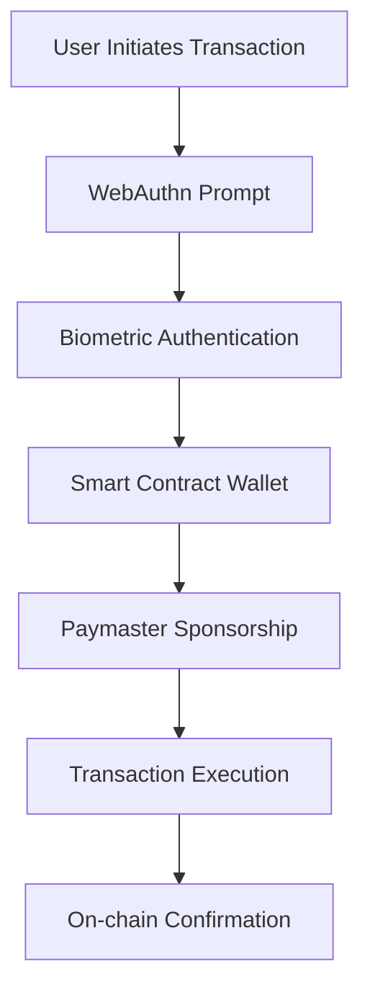

# Welcome to HumanWallet

HumanWallet is a comprehensive Web3 wallet solution that combines **WebAuthn passkey authentication** with **account abstraction (ERC-4337)** to deliver a seamless, secure, and user-friendly blockchain experience.

## What Makes HumanWallet Different?

Traditional Web3 wallets require users to manage complex seed phrases and private keys, creating significant barriers to adoption. HumanWallet eliminates these pain points by leveraging modern authentication standards and smart contract technology.

<Cards>
  <Card 
    title="🔐 Biometric Authentication" 
    description="Sign transactions with FaceID, TouchID, or device PIN using WebAuthn passkeys"
  />
  <Card 
    title="🛡️ Account Abstraction" 
    description="Smart contract wallets with gasless transactions and advanced features via ERC-4337"
  />
  <Card 
    title="🌐 Universal Compatibility" 
    description="Works with any EVM-compatible blockchain and integrates seamlessly with existing dApps"
  />
  <Card 
    title="🔧 Developer Friendly" 
    description="Drop-in replacement for traditional wallet connectors with full TypeScript support"
  />
</Cards>

## Key Features

### 🆔 No Seed Phrases
Users authenticate with their device's built-in biometrics instead of managing complex private keys. This eliminates the risk of lost or stolen seed phrases while maintaining security through hardware-backed authentication.

### ⛽ Gasless Transactions
Optional gas sponsorship through configurable paymasters means users can interact with dApps without needing to hold native tokens for transaction fees.

### 📱 Mobile-First Design
Works seamlessly on mobile devices without requiring app installation. Users can access their wallet through any web browser using their device's native authentication.

### 🔒 Enhanced Security
- **Hardware Security**: Private keys stored in secure device enclaves
- **WebAuthn Standard**: Uses W3C WebAuthn specification for secure authentication
- **EIP-6492**: Smart contract signature verification standard
- **Audited Dependencies**: Built on audited ZeroDev and Viem foundations

## How It Works



1. **Authentication**: User authenticates using device biometrics (FaceID/TouchID)
2. **Smart Wallet**: Transaction is processed through a smart contract wallet
3. **Gas Sponsorship**: Optional paymaster covers transaction fees
4. **Execution**: Transaction is bundled and executed on-chain

## Architecture Overview

HumanWallet is built as a modular monorepo with the following packages:

```
humanwallet/
├── packages/
│   ├── connector/     # Wagmi connector for HumanWallet
│   ├── core/          # Core functionality and business logic  
│   ├── types/         # Shared TypeScript type definitions
│   └── sdk/           # High-level SDK combining all packages
├── apps/              # Demo applications
└── examples/          # Integration examples
```

### Core Packages

| Package | Purpose | Key Features |
|---------|---------|--------------|
| `@humanwallet/connector` | Wagmi-compatible wallet connector | WebAuthn auth, account abstraction, transaction handling |
| `@humanwallet/core` | Core business logic and actions | Ethereum interactions, key management, domain architecture |
| `@humanwallet/types` | Shared TypeScript definitions | Type safety across all packages |
| `@humanwallet/sdk` | Unified SDK interface | High-level API combining all functionality |

## Quick Start

Get started with HumanWallet in just a few steps:

### Installation

```bash
npm install @humanwallet/connector viem wagmi
```

### Basic Integration

```typescript
import { humanWalletConnector } from '@humanwallet/connector'
import { createConfig } from 'wagmi'
import { mainnet, polygon } from 'wagmi/chains'

const connector = humanWalletConnector({
  projectId: 'your-zerodev-project-id',
  appName: 'My DApp',
  dappMetadata: {
    name: 'My DApp',
    url: 'https://mydapp.com',
    iconUrl: 'https://mydapp.com/icon.png'
  }
})

const config = createConfig({
  chains: [mainnet, polygon],
  connectors: [connector]
})
```

### React Usage

```tsx
import { useConnect, useAccount } from 'wagmi'

function ConnectWallet() {
  const { connect, connectors } = useConnect()
  const { address } = useAccount()

  const humanWallet = connectors.find(c => c.id === 'humanWallet')

  if (address) {
    return <div>Connected: {address}</div>
  }

  return (
    <button onClick={() => connect({ connector: humanWallet })}>
      Connect with HumanWallet
    </button>
  )
}
```

## What's Next?

<Cards>
  <Card 
    title="🚀 Quick Start Guide" 
    href="/docs/quickstart"
    description="Get up and running with HumanWallet in minutes"
  />
  <Card 
    title="📚 API Reference" 
    href="/docs/api"
    description="Comprehensive API documentation and examples"
  />
  <Card 
    title="🎯 Integration Examples" 
    href="/docs/examples"
    description="Real-world integration examples and best practices"
  />
  <Card 
    title="🔧 Configuration" 
    href="/docs/configuration"
    description="Advanced configuration options and customization"
  />
</Cards>

## Technology Stack

HumanWallet is built with modern, production-ready technologies:

- **TypeScript** - Type-safe development across all packages
- **Viem** - Modern Ethereum library for type-safe blockchain interactions
- **Wagmi** - React hooks for Ethereum, providing the connector interface
- **ZeroDev SDK** - Account abstraction and passkey infrastructure
- **WebAuthn** - W3C standard for secure authentication
- **React** - UI framework for demo applications and examples

## Community & Support

- **GitHub**: [HumanWallet/humanwallet](https://github.com/HumanWallet/humanwallet)
- **Issues**: Bug reports and feature requests
- **Discussions**: Community support and questions

---

Ready to revolutionize your Web3 user experience? Let's get started! 🚀